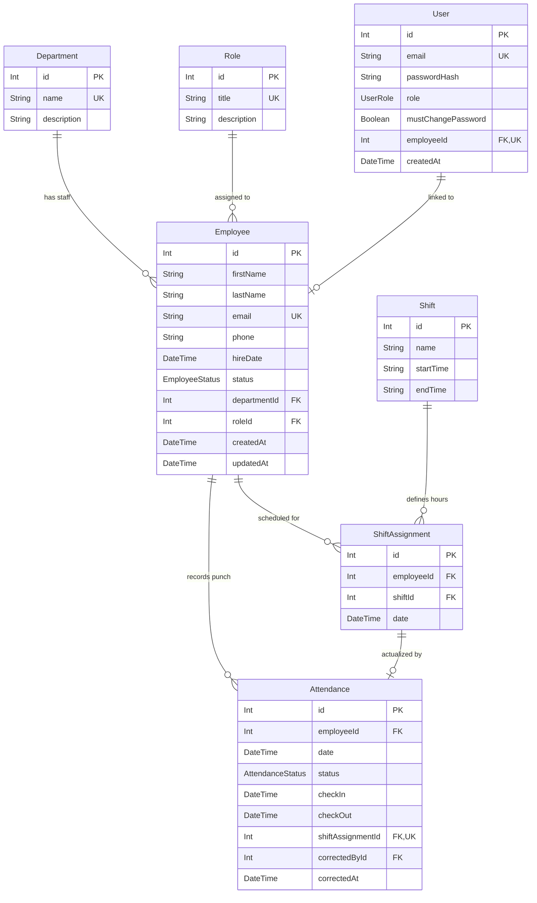

# Hotel Employee Management System (HRMS)

A clean, production-grade Hotel Employee Management System built as a technical challenge submission. The system manages hotel departments, roles, staff profiles, 24/7 rotational shifts, shift scheduling, real-time punch attendance with automated late-status derivation, and analytical reporting.

---

## 1. Architecture Overview

The application is structured into a decoupled, layered client-server architecture. The frontend Single Page Application communicates via typed RESTful HTTP endpoints with the backend Express API. Business logic (such as auto-deriving tardiness based on shift start times and grace periods) is strictly encapsulated within isolated service modules rather than controllers. Prisma ORM mediates all transactions and aggregations with the underlying PostgreSQL container.

```
+-----------------------------------------------------------------------+
|                    React Frontend SPA (Vite + Tailwind)               |
|         [Employee Directory] [Attendance] [Shifts] [Reports Chart]    |
+-----------------------------------+-----------------------------------+
                                    |
                            HTTP / REST JSON
                                    |
+-----------------------------------v-----------------------------------+
|                        Node.js + Express API                          |
|  [Zod Validation] -> [Controllers] -> [Isolated Business Services]    |
|                  -> [Centralized Error Middleware]                    |
+-----------------------------------+-----------------------------------+
                                    |
                              Prisma Client
                                    |
+-----------------------------------v-----------------------------------+
|                       PostgreSQL 16 Database                          |
|         (Enforced DB-Level Unique Constraints & Foreign Keys)          |
+-----------------------------------------------------------------------+
```

---

## 2. Database Design & Entity Relationship Diagram

### Mermaid ERD



### Core Design Decisions

1. **Role-Based Authentication & Departmental Scoping:**
   - Employs secure, HTTP-only cookie-based JWT authentication (`sameSite: 'lax'`, `httpOnly: true`).
   - Granular authorization scopes are strictly verified inside the backend service layer rather than relying on client input.
   - Department Managers are department-bounded: they can only create and manage employees, assign shifts, and view punches within their assigned department.
2. **Soft-Delete for Employees (`status: INACTIVE`):**
   - When an employee departs or is deleted, their record is updated to `status: INACTIVE` instead of executing a physical SQL `DELETE`. This preserves historical attendance, timesheet, and shift reporting data integrity without orphaned records.
3. **Compound Unique Constraints at the Database Level:**
   - Both `ShiftAssignment` and `Attendance` enforce `@@unique([employeeId, date])`. This guarantees at the database level that an employee cannot be double-booked on the same calendar day or submit duplicate attendance entries.
4. **Attendance Lifecycle & Role Separation:**
   - **`POST /api/attendance` (Check-In):** Creates the initial daily check-in record. For Staff, re-calling this endpoint is strictly rejected with `409 Conflict` to prevent overwriting timestamps.
   - **`PATCH /api/attendance/checkout` (Check-Out):** Dedicated endpoint that completes the daily record and enforces chronological order (`checkOut > checkIn`).
   - **`PATCH /api/attendance/:id/correct` (Administrative Correction):** Restricted to `ADMIN` and `MANAGER` roles only. Stamps `correctedById` and `correctedAt` for complete audit accountability.
5. **Dynamic Automated Status Derivation:**
   - **`PRESENT`:** Check-in within the scheduled shift start + 10-minute grace window.
   - **`LATE`:** Check-in past the 10-minute grace period.
   - **`PARTIAL_PRESENT`:** Clock-out earlier than the scheduled shift end time.
   - **`ABSENT`:** No check-in recorded for a scheduled shift.
   - **`ON_LEAVE`:** Explicitly authorized leave.
6. **Live Synced Clock & Pre/Post Shift Range Controls:**
   - The punch clock is continuously synchronized in real-time down to the second.
   - Staff can only punch in starting 30 minutes prior to scheduled shift start (`shift.startTime - 30m`), with automated visual button locks.

---

## 3. Role-Based Access Control (RBAC) & Authentication

### Demo Credentials Table

| Role | Email | Password | Access Scope |
| :--- | :--- | :--- | :--- |
| **Super Admin** | `admin@noruhotel.com` | `Admin123!` | Full system control: Departments, Roles, Shifts, Employees, Scheduling, Attendance, All Reports, User Provisioning. |
| **Front Desk Manager** | `manager.frontdesk@noruhotel.com` | `Manager123!` | Front Desk employees only: view/edit staff, assign shifts, manage punches, department analytics. |
| **Housekeeping Manager** | `manager.housekeeping@noruhotel.com` | `Manager123!` | Housekeeping staff only: department scheduling, attendance tracking, department absenteeism. |
| **Kitchen & F&B Manager** | `manager.kitchen@noruhotel.com` | `Manager123!` | Kitchen staff only: kitchen shift assignments, attendance logs, department reports. |
| **Maintenance Manager** | `manager.maintenance@noruhotel.com` | `Manager123!` | Maintenance staff only: technician shifts, punch logs, department reports. |
| **Staff Member (Elena)** | `elena.r@hotelhrms.com` | `Staff123!` | Self-service only: View personal shift schedule, live punch in/out within pre-shift window. |

### Staff Auto-Provisioning & Temporary Password Flow
- When an employee is created via `POST /api/employees`, a linked `User` record with role `STAFF` and `mustChangePassword: true` is automatically provisioned with a secure, randomly generated temporary password (hashed with `bcrypt`).
- The temporary password is returned **once** in the API response payload and displayed in an interactive copy modal.

### Forced Password Change Enforcement
- Accounts flagged with `mustChangePassword === true` are intercepted by the `requireAuth` middleware and blocked from all protected operational endpoints with HTTP `403 Forbidden` (`PASSWORD_CHANGE_REQUIRED`), allowing only `/api/auth/change-password` and `/api/auth/logout`.
- The frontend renders an unclosable password change overlay, preventing navigation until a new password has been configured.

### Authorization Matrix

| Resource / Endpoint | Super Admin (`ADMIN`) | Department Manager (`MANAGER`) | Staff Member (`STAFF`) |
| :--- | :---: | :---: | :---: |
| **Departments / Roles CRUD** | Full Access | Read-Only | Read-Only |
| **Shift Definitions CRUD** | Full Access | Read-Only | Read-Only |
| **Employees List & Details** | All Departments | Own Department Only | Forbidden (403) |
| **Employee Create / Edit / Deactivate** | All Departments | Own Department Only | Forbidden (403) |
| **Shift Scheduling (`ShiftAssignment`)** | All Departments | Own Department Only | Own Schedule (Read-Only) |
| **Attendance Punch In (`POST /attendance`)** | Full Administrative | Own Department Staff | Self Punch-In Only |
| **Attendance Check-Out (`PATCH /checkout`)** | Full Administrative | Own Department Staff | Self Check-Out Only |
| **Attendance Correction (`PATCH /:id/correct`)** | Full Audited Access | Own Department Staff | Forbidden (403) |
| **Reports & Analytics (Rate, Absenteeism, Roster)** | All Departments | Own Department Data | Forbidden (403) |
| **User Registration (`/api/auth/register`)** | Manager / Admin Accounts | Forbidden (403) | Forbidden (403) |

---

## 4. The Non-Trivial Report: `/api/reports/attendance-rate`

The flagship analytical query is served at:
```http
GET /api/reports/attendance-rate?department=&month=YYYY-MM
```

### Why it is Non-Trivial:
1. **Multi-Table Relational Join:** Joining `Attendance` records with `Employee` and `Department` entities while filtering by active employee status and specific calendar month boundaries (`startDate` to `endDate`).
2. **Grouped Statistical Aggregation:** Aggregating total shifts recorded, present counts, late arrivals, partial presents, absences, and approved leaves per department.
3. **Operational Attendance Rate Formula:**
   $$\text{Attendance Rate (\%)} = \frac{\text{Present Count} + \text{Late Count} + \text{Partial Present Count}}{\text{Total Records} - \text{On-Leave Count}} \times 100$$
   Approved leaves (`ON_LEAVE`) are excluded from expected working days so employees taking legitimate paid time off do not penalize their department's operational readiness score.
4. **Punctuality Metric:**
   $$\text{On-Time Rate (\%)} = \frac{\text{Present Count}}{\text{Total Records} - \text{On-Leave Count}} \times 100$$

---

## 5. How to Run the Project

### Prerequisites
- [Docker & Docker Compose](https://www.docker.com/)
- [Node.js](https://nodejs.org/) (v18+ or v20+)
- npm

### 1. Start PostgreSQL Database
From the project root:
```bash
docker-compose up -d
```

### 2. Setup & Run Backend API
```bash
cd backend
npm install
npx prisma migrate dev --name init
npx prisma db seed
npm run dev
```
Backend API will start at: `http://localhost:5000`  
Interactive Swagger OpenAPI Docs: `http://localhost:5000/api-docs`

### 3. Run Unit Tests (Late-Derivation Logic)
```bash
cd backend
npm test
```

### 4. Setup & Run Frontend Web App
In a new terminal window:
```bash
cd frontend
npm install
npm run dev
```
Frontend Web Application will be available at: `http://localhost:3000`

---

## 6. API Endpoints Summary

| Method | Endpoint | Description |
|---|---|---|
| `GET/POST` | `/api/employees` | List with filters & pagination / Create employee (Manager department-scoped) |
| `GET/PUT/DELETE` | `/api/employees/:id` | Get details / Update / Soft-delete (`INACTIVE`) |
| `GET/POST` | `/api/departments` | List departments / Create department (Admin only) |
| `GET/PUT/DELETE` | `/api/departments/:id` | Get / Update / Delete department |
| `GET/POST` | `/api/roles` | List roles / Create role (Admin only) |
| `GET/PUT/DELETE` | `/api/roles/:id` | Get / Update / Delete role |
| `GET/POST` | `/api/shifts` | List shifts / Create shift definition |
| `GET/PUT/DELETE` | `/api/shifts/:id` | Get / Update / Delete shift |
| `POST` | `/api/shift-assignments` | Assign shift to employee for date |
| `GET` | `/api/shift-assignments` | Filter by `date`, `employeeId`, `departmentId` |
| `POST` | `/api/attendance` | Record punch check-in (enforces non-overwrite for Staff) |
| `PATCH` | `/api/attendance/checkout` | Record check-out (auto-derives `PARTIAL_PRESENT` if before shift end) |
| `PATCH` | `/api/attendance/:id/correct` | Administrative correction with `correctedById` and `correctedAt` audit stamps (Admin/Manager only) |
| `GET` | `/api/attendance` | List attendance history with date range, department, and status filters |
| `GET` | `/api/reports/attendance-rate` | Monthly per-department attendance rates & statistics |
| `GET` | `/api/reports/absenteeism` | Top employees ranked by absent + late occurrences |
| `GET` | `/api/reports/roster` | Shift roster for date grouped by department & shift |

---

## 7. Future Enhancements (Deliberately Scoped Out)

The following capabilities were considered during system design but deliberately scoped out to keep this technical challenge submission concise, maintainable, and aligned with the 1-day time budget:

### 📅 Scheduling & Staffing
- **Minimum staffing thresholds per shift:** Would require a `minStaffCount` field on `Shift` and an aggregation query comparing scheduled assignments against minimum requirements.
- **Minimum rest period enforcement between consecutive shifts:** Would require a validation check in `ShiftAssignmentService` enforcing an 8-to-11 hour mandatory rest buffer between consecutive shifts.
- **Shift swap requests between employees:** Would require a `ShiftSwapRequest` model and an atomic Prisma `$transaction` swapping assignments upon manager approval.

### ⏱️ Attendance & Payroll-Adjacent
- **Computed hours-worked per employee from checkIn/checkOut:** Would require a timesheet service calculating exact hours (deducting scheduled unpaid meal breaks) aggregated across pay periods.
- **Overtime detection against shift durations:** Would require an overtime engine comparing daily computed hours against scheduled shift length or weekly standard thresholds (> 40 hours/week).
- **Escalation notifications for repeated lateness/absence:** Would require an asynchronous worker scanning rolling 30-day infraction counts and alerting department heads upon reaching 3+ events.

### 🌴 Leave Management Depth
- **Leave balance & annual quota tracking per employee:** Would require an `EmployeeLeaveQuota` table (`employeeId`, `year`, `totalDays`, `usedDays`, `remainingDays`) and transactional validation.
- **Differentiated leave types:** Would require expanding the schema with a `LeaveType` enum (`SICK`, `ANNUAL_VACATION`, `MATERNITY`, `UNPAID`).

### 👥 Employee Lifecycle
- **Probation period logic derived from hireDate:** Would require a utility method checking whether `today < hireDate + 90 days`.
- **Full department and role transfer history:** Would require an `EmployeeAssignmentHistory` table with `effectiveStartDate` and `effectiveEndDate`.
- **Explicit offboarding cascade flow:** Would require an offboarding routine wrapped in a Prisma `$transaction` that sets `Employee.status = INACTIVE` and automatically deletes or cancels all future `ShiftAssignment` records where `date > today`.

### 📊 Reporting Depth
- **Department headcount and attrition trends over time:** Would require querying historical hire dates, deactivation timestamps, and status change audit logs.
- **Shift coverage matrix across date ranges:** Would require a multi-day matrix query cross-referencing required staffing quotas against actual scheduled assignments. calendar weeks.
