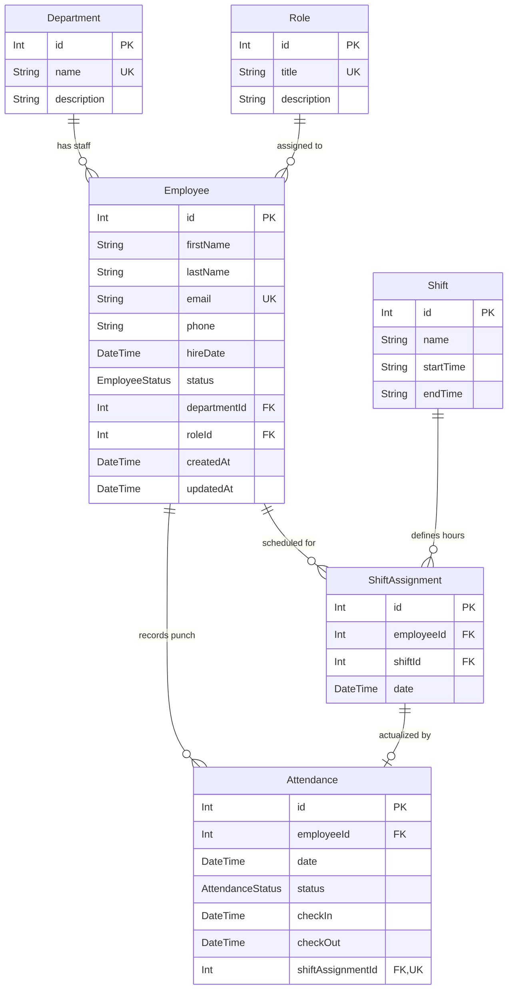

# Hotel Employee Management System (HRMS)

A clean, production-grade Hotel Employee Management System built as a technical challenge submission. The system manages hotel departments, roles, staff profiles, 24/7 rotational shifts, shift scheduling, real-time punch attendance with automated late-status derivation, and analytical reporting.

---

## 1. Architecture Overview

The application is structured into a decoupled, layered client-server architecture. The frontend Single Page Application communicates via typed RESTful HTTP endpoints with the backend Express API. Business logic (such as auto-deriving tardiness based on shift start times and grace periods) is strictly encapsulated within isolated service modules rather than controllers. Prisma ORM mediates all transactions and aggregations with the underlying PostgreSQL container.

```
+-----------------------------------------------------------------------+
|                    React Frontend SPA (Vite + Tailwind)               |
|         [Employee Directory] [Attendance] [Shifts] [Reports Chart]    |
+-----------------------------------+-----------------------------------+
                                    |
                            HTTP / REST JSON
                                    |
+-----------------------------------v-----------------------------------+
|                        Node.js + Express API                          |
|  [Zod Validation] -> [Controllers] -> [Isolated Business Services]    |
|                  -> [Centralized Error Middleware]                    |
+-----------------------------------+-----------------------------------+
                                    |
                              Prisma Client
                                    |
+-----------------------------------v-----------------------------------+
|                       PostgreSQL 16 Database                          |
|         (Enforced DB-Level Unique Constraints & Foreign Keys)          |
+-----------------------------------------------------------------------+
```

---

## 2. Database Design & Entity Relationship Diagram

### Mermaid ERD



### Core Design Decisions

1. **Single Department & Role FKs with Evolutionary Path:**
   - *Current Design:* `Employee` holds direct foreign keys to `Department` and `Role`. This deliberate scope decision ensures zero overhead and clean queries for a 1-day system.
   - *Future Evolution:* In a larger enterprise scale, this would evolve to `EmployeeDepartmentHistory` and `EmployeeRoleHistory` tables with `startDate`, `endDate`, and `isCurrent` flags to track promotions and inter-department transfers across time.
2. **Soft-Delete for Employees (`status: INACTIVE`):**
   - When an employee departs or is deleted, their record is updated to `status: INACTIVE` instead of executing a physical SQL `DELETE`. This preserves historical attendance, timesheet, and shift reporting data integrity without orphaned records.
3. **Compound Unique Constraints at the Database Level:**
   - Both `ShiftAssignment` and `Attendance` enforce `@@unique([employeeId, date])`. This guarantees at the database level that an employee cannot be double-booked on the same calendar day or submit duplicate attendance entries.
4. **Separation of Intent vs. Reality (`ShiftAssignment` vs. `Attendance`):**
   - `ShiftAssignment` represents the planned roster (schedule intent).
   - `Attendance` represents what actually occurred (punch timestamps and actual status).
   - Linking via `shiftAssignmentId` allows cross-referencing scheduled shift start time against actual punch-in time to compute automated punctuality metrics.

---

## 3. Important Decisions & Tradeoffs

- **Framework & Simplicity:** Implemented with Express + TypeScript for clear architecture and direct control over error mapping.
- **Auto-Derived Late Logic as a Pure Function:** `deriveAttendanceStatus()` in `attendance.service.ts` is decoupled from HTTP concerns and database state, making it fast and unit-testable in milliseconds.
- **Pagination Defaults:** All list endpoints (`/api/employees`, `/api/attendance`, `/api/shift-assignments`) support `?page=&pageSize=`. Even with small sample datasets, this ensures API contract scalability and prevents unbounded memory consumption in production.
- **Tradeoffs for 1-Day Budget:**
  - *Authentication & RBAC:* Auth is omitted in accordance with prompt guidelines. In production, JWT middleware with role-based permissions (`ADMIN`, `HR_MANAGER`, `STAFF`) would protect sensitive routes.
  - *Multi-department Shift Coverage:* Currently staff belong to one home department. A hotel with cross-trained banquet servers could extend `ShiftAssignment` to allow assigning staff to shifts outside their primary department.

---

## 4. The Non-Trivial Report: `/api/reports/attendance-rate`

The flagship analytical query is served at:
```http
GET /api/reports/attendance-rate?department=&month=YYYY-MM
```

### Why it is Non-Trivial:
Calculating true hotel department attendance rate requires:
1. **Multi-Table Relational Join:** Joining `Attendance` records with `Employee` and `Department` entities while filtering by active employee status and specific calendar month boundaries (`startDate` to `endDate`).
2. **Grouped Statistical Aggregation:** Aggregating total shifts recorded, present counts, late arrivals, absences, and approved leaves per department.
3. **Operational Attendance Rate Formula:**
   $$\text{Attendance Rate (\%)} = \frac{\text{Present Count} + \text{Late Count}}{\text{Total Records} - \text{On-Leave Count}} \times 100$$
   Approved leaves (`ON_LEAVE`) are excluded from expected working days so employees taking legitimate paid time off do not penalize their department's operational readiness score.
4. **Punctuality Metric:**
   $$\text{On-Time Rate (\%)} = \frac{\text{Present Count}}{\text{Total Records} - \text{On-Leave Count}} \times 100$$

---

## 5. How to Run the Project

### Prerequisites
- [Docker & Docker Compose](https://www.docker.com/)
- [Node.js](https://nodejs.org/) (v18+ or v20+)
- npm

### 1. Start PostgreSQL Database
From the project root:
```bash
docker-compose up -d
```

### 2. Setup & Run Backend API
```bash
cd backend
npm install
npx prisma migrate dev --name init
npx prisma db seed
npm run dev
```
Backend API will start at: `http://localhost:5000`
Interactive Swagger OpenAPI Docs: `http://localhost:5000/api-docs`

### 3. Run Unit Tests (Late-Derivation Logic)
```bash
cd backend
npm test
```

### 4. Setup & Run Frontend Web App
In a new terminal window:
```bash
cd frontend
npm install
npm run dev
```
Frontend Web Application will be available at: `http://localhost:3000`

---

## 6. API Endpoints Summary

| Method | Endpoint | Description |
|---|---|---|
| `GET/POST` | `/api/employees` | List with filters & pagination / Create employee |
| `GET/PUT/DELETE` | `/api/employees/:id` | Get details / Update / Soft-delete (`INACTIVE`) |
| `GET/POST` | `/api/departments` | List departments / Create department |
| `GET/PUT/DELETE` | `/api/departments/:id` | Get / Update / Delete department |
| `GET/POST` | `/api/roles` | List roles / Create role |
| `GET/PUT/DELETE` | `/api/roles/:id` | Get / Update / Delete role |
| `GET/POST` | `/api/shifts` | List shifts / Create shift definition |
| `GET/PUT/DELETE` | `/api/shifts/:id` | Get / Update / Delete shift |
| `POST` | `/api/shift-assignments` | Assign shift to employee for date |
| `GET` | `/api/shift-assignments` | Filter by `date`, `employeeId`, `departmentId` |
| `POST` | `/api/attendance` | Record punch-in/out (auto-evaluates 10-min grace period) |
| `GET` | `/api/attendance` | List attendance history with date range & status filters |
| `GET` | `/api/reports/attendance-rate` | Monthly per-department attendance rates & statistics |
| `GET` | `/api/reports/absenteeism` | Top employees ranked by absent + late occurrences |
| `GET` | `/api/reports/roster` | Shift roster for date grouped by department & shift |
